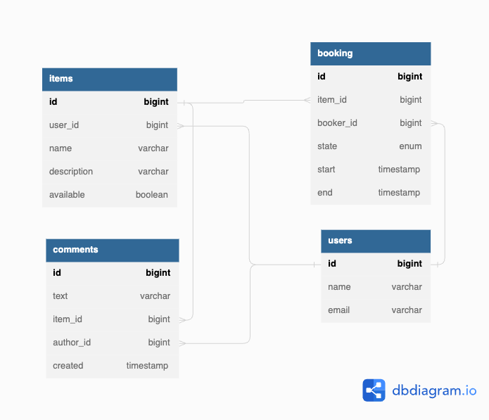

# ShareIt
Сервис для шеринга (от англ. share — «делиться») вещей.

Серис позволяет пользователям:
- рассказывать, какими вещами они готовы поделиться;
- находить нужную вещь и брать её в аренду на какое-то время.

## Список изменений
### **14/12/2022**

#### Добавлены:
- модели данных item и user, и dto для каждого из них
- классы-мапперы для базовых сущностей Item и User с использованием
  готовой библиотеки ModelMapper
- базовая логика сервиса с использование классической структуры слоев
  Controller -> Service -> Repository
- следующие функции для работы с сущеностью User:
    - методы основных CRUD операций
- следующие функции для работы с сущеностью Item:
    - методы основных CRUD операций
    - поиск вещи по названию или описанию
- сохранение данных о пользователях в памяти.

### **04/01/2023**

#### Добавлены:
- модели данных booking и comment, dto для каждого из них
- классы-мапперы для сущностей Booking и Comment с использованием 
готовой библиотеки ModelMapper
- репозиторий с использованием JpaRepository
- БД
- функция бронирования вещей:
  - добавление нового запроса на бронирование
  - подтверждение или отклонение запроса на бронирование владельцем вещи
  - Получение данных о конкретном бронировании (включая его статус)
  - получение списка всех бронирований текущего пользователя 
  (можно делать выборку по статусу)
  - получение списка бронирований для всех вещей владельца 
  (можно делать выборку по статусу)
- функция оставления комментария к вещи после завершения бронирования

**Структура базы данных**

